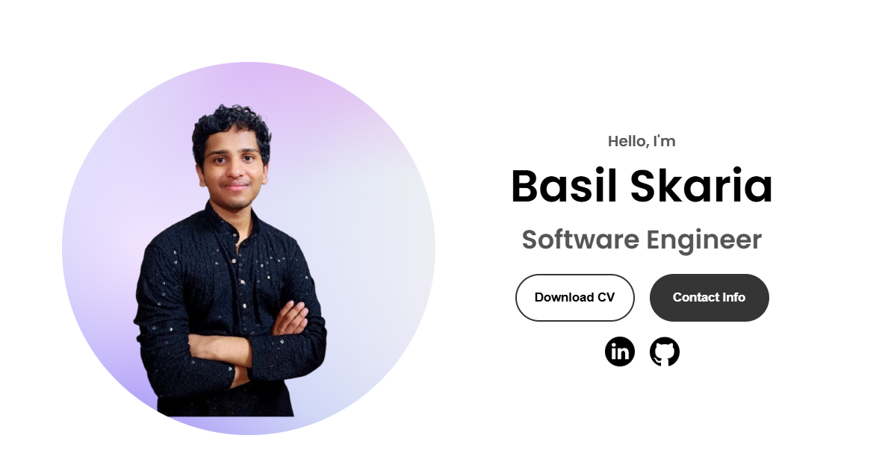

# 🚀 Personal Portfolio Website  

[](https://basilskaria.vercel.app/)  
[](https://github.com/Basilskar/my_portfolio)  

## 📌 Overview  
This is my personal portfolio website showcasing my skills, projects, and experience. The website features a modern and **responsive UI** with a clean and minimalistic design.  

  

## ✨ Features  
- 🌟 **Amazing UI** – Visually appealing and clean layout  
- 📱 **Fully Responsive** – Works seamlessly on all devices  
- ⚡ **Fast Performance** – Optimized for quick load times  
- 📂 **Projects Showcase** – Highlights key projects with details  
- 📧 **Contact Section** – Users can reach out directly  

## 🛠️ Tech Stack  
- **Frontend:** HTML, CSS, JavaScript  
- **Deployment:** Vercel  

## 🚀 Live Demo  
🔗 [Visit my portfolio](https://basilskaria.vercel.app/)  

## 📌 Installation & Setup  
To run this project locally:  
1. Clone the repository:  
   ```bash
   git clone https://github.com/Basilskar/my_portfolio.git
